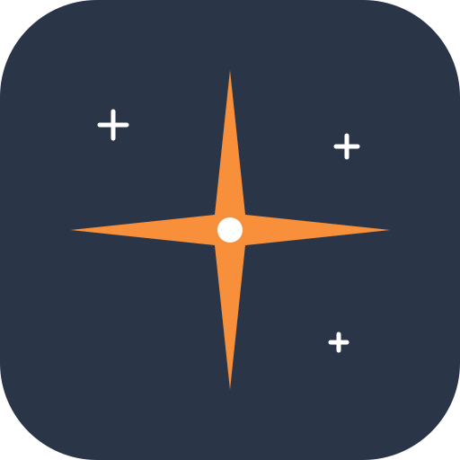

  

<h1 align="center">Constellation</h1>

Share your live location privately, for as long as you choose.

  <a href="https://constellation.taskyon.space"><strong>Open the web app</strong></a>
  · <a href="https://github.com/yeus/constellation/releases/latest"><strong>Download Android &amp; Linux apps</strong></a>
  · <a href="https://github.com/yeus/constellation">GitHub project</a>

Constellation is a free, open-source app for live location sharing. Create a
private link or QR code and send it to someone you trust. They can open it in
their browser without creating an account.

> **No cloud location history.** Your location updates travel between your
> device and the people you authorize over end-to-end encrypted,
> peer-to-peer connections. If a direct connection is unavailable, a relay may
> forward the encrypted traffic, but it cannot read your location.
> Constellation has no cloud database for locations and keeps no server-side
> location history.
>
> While sharing, the app holds the latest position temporarily in memory on
> participating devices; it does not save a location timeline. Private app
> data such as saved links and sharing settings may be kept in protected
> storage on your device. People you share with can still copy or save what
> they see.

> **Early release:** Constellation 0.1 is under active development. Background
> updates can be delayed by battery settings, GPS availability, or connectivity.

## Choose how to use it

| Platform        | Get started                                                                              | What to expect                                                                                                 |
| --------------- | ---------------------------------------------------------------------------------------- | -------------------------------------------------------------------------------------------------------------- |
| **Web browser** | [Open Constellation](https://constellation.taskyon.space)                                | No installation. Keep the app open while sharing.                                                              |
| **Android**     | [Download the APK](https://github.com/yeus/constellation/releases/latest)                | Can keep sharing in the background, with the required location permissions. Currently built for arm64 devices. |
| **Linux**       | [Download an AppImage or Flatpak](https://github.com/yeus/constellation/releases/latest) | A separate desktop app. Currently built for x86_64 systems.                                                    |

For Android, open the downloaded APK and allow installation from that source if
prompted. For Linux AppImage, allow the downloaded file to run as a program in
its file properties, then open it. For Flatpak, install the downloaded bundle
with your software manager or `flatpak install --user ./APP.flatpak`, replacing
`APP.flatpak` with the downloaded filename. Linux needs an unlocked desktop
keyring to save private sharing settings.

## Share in three steps

1. **Choose what to share.** Tap **Share location**, select exact location, an
   approximate area (1 km radius), or a very coarse area (20 km radius), and choose
   how long the link lasts.
2. **Send the private link or QR code.** Anyone with it can view your location
   while the link is active. Treat it like a password.
3. **Stay in control.** See connected viewers, manage your active links, and
   stop a link whenever you want. Each link can be stopped separately.

Received a link? Open it to preview the location. Choose **Keep following** to
save it on your device. You can follow several people, give them private
nicknames and colors, and use **Following** in the upper-left menu to see their
latest updates. Sharing your own location back is a separate choice.

## Built for private sharing

- **No account needed:** share a link rather than signing up.
- **Your choice of precision:** share a point or an approximate area.
- **Your choice of duration:** links expire, and you can stop them earlier.
- **Multiple people:** follow several locations and see when they last updated.
- **Android background sharing:** keep an active share running when the app is
  closed, subject to Android permissions and power settings.
- **Open source:** inspect the code, report a problem, or help improve it.

## A few things to know

Keep private links private: recipients can save or forward what they receive.
Approximate sharing reduces precision but does not hide every detail of your
movement. Relays can see connection metadata, and the map provider sees map
requests that may reveal the area you are viewing. Browser sharing depends on
the configured relay being reachable.

Open **Privacy and licenses** from the menu for details. The menu also links to
the GitHub project and app downloads.

## Screenshots

  
  
  

## Help and contribute

[Report a problem or suggest an improvement](https://github.com/yeus/constellation/issues).
Please describe what happened and which app you use. Review any logs or
screenshots before posting them, and remove private links or personal details.

Want to build Constellation or contribute code? See the
[development and release guide](docs/DEVELOPMENT.md).

## License and map credits

Constellation is [MIT licensed](LICENSE). The map credits OpenStreetMap
contributors, Protomaps, and ESA WorldCover. See
[third-party notices](THIRD_PARTY_NOTICES.md) for bundled software and map assets.
